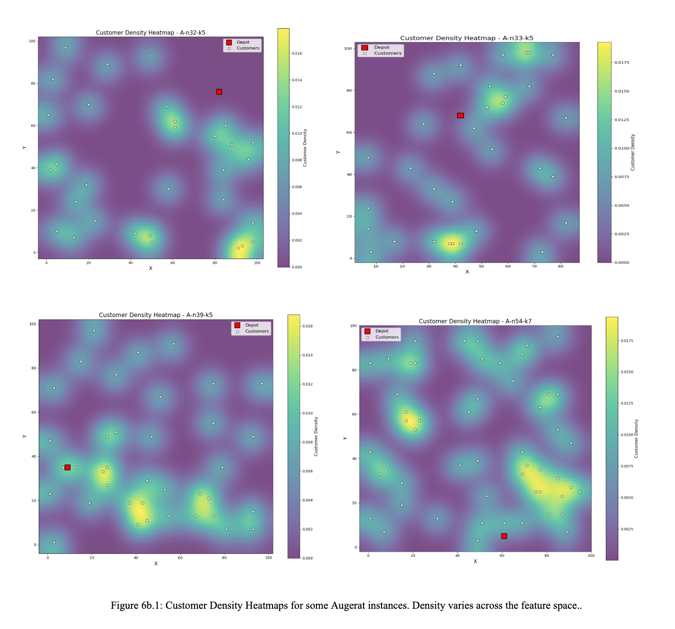
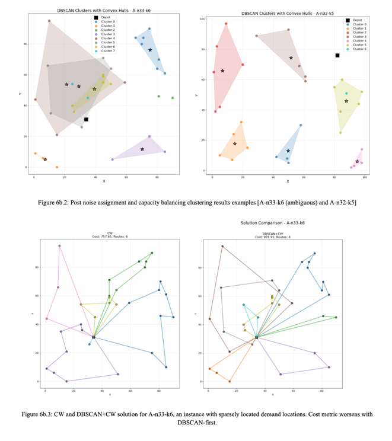
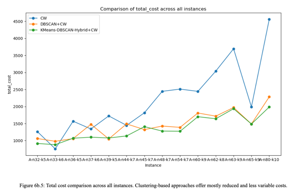
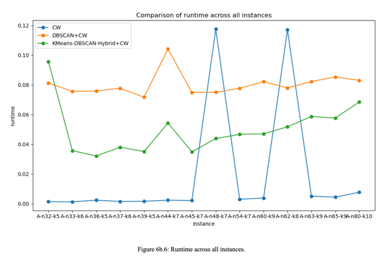
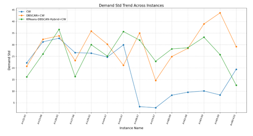
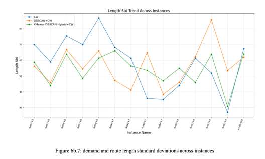

### DBSCAN and Clustering for the Vehicle Routing Problem

The Vehicle Routing Problem (VRP) occupies a central place in the field of combinatorial optimization, demanding efficient routes for a fleet of vehicles that must serve a given set of customers from a common depot. In this project, our aim was to explore how density-based clustering, specifically the DBSCAN algorithm, can be leveraged to decompose the VRP into more tractable subproblems and thereby enhance route efficiency. A traditional approach, the Clarke-Wright (CW) savings heuristic, serves as our baseline. Upon this foundation, we investigated two density-based clustering-augmented strategies: a direct DBSCAN integration with CW (DBSCAN+CW), and a hybrid combining K-means and DBSCAN with Tabu Search (KMeans+DBSCANTabuSearch) which aimed to exploit both the clustering structure and the explorative power of advanced local search. All produced routing solutions were produced from Augerat instances, a classic family of benchmark problems for the Capacitated Vehicle Routing Problem, first introduced by Augerat et al. in 1995. They are designed to represent realistic distribution scenarios–with customer locations, demands, and a homogeneous fleet of capacitated vehicles–and have since become one of the most widely used testbeds for both exact and heuristic capacitated VRP algorithms. These instances are denoted by names like A-n32-k5 or A-n80-k10, where the number after ‘n’ indicates the number of customers and the number after “k” indicates the fixed number of available vehicles. Distances are computed as rounded Euclidean distances between customer coordinates, vehicle capacity is uniform across all routes, and customer demands are specified as integers. In this project, our proposed methods are tested on problems from 32 up to 80 customers, with route limits ranging from 5 to 10 vehicles.
Our experimental workflow began with the straightforward implementation of the CW savings algorithm, which we use both as a quality benchmark in total route distance and as a measure of computational efficiency. For the DBSCAN+CW variant, we strictly enforced pure customer-to-customer proximity, and removed any weighting of distances to the depot. Once DBSCAN produced clusters, CW ran independently on each one, treating the depot plus cluster members as isolated subproblems. Our rationale for exploring density-based approaches of clustering stems from several inherent qualities of DBSCAN. Unlike partitioning methods that assume spherical clusters, DBSCAN identifies arbitrarily shaped dense regions, which we believe aligns more closely with natural geographic customer patterns. Indeed, as shown by Figure 6b.1, customer distributions in the Augerat instance test set were characterized by non-uniform variances across the feature space. Additionally, its ability to flag outliers allows for specialized treatment of sparsely located customers–either by reassigning them to nearby clusters or creating dedicated short routes–thus avoiding the distortions that uniform partitioning can introduce. 

To account for the fact that DBSCAN may label some customers as noise—especially in instances with heterogeneous or sparsely distributed demand points—we extended our clustering pipeline with a targeted noise‐handling and capacity‐balancing stage. In practice, once the core DBSCAN clusters are identified, any “noise” points are examined individually: each such point is compared by Euclidean distance both to the centroid of every existing cluster and to the depot, and is assigned to the nearest cluster whenever that distance is less than 1.5 × its distance to the depot; otherwise, it is seeded as its own singleton cluster. This rule prevents isolated customers from being forced into distant routes when their spatial isolation would imply excessive travel, yet avoids leaving them unassigned.
After noise assignment, we enforce vehicle‐capacity constraints via a split‐and‐balance procedure. Any cluster whose total customer demand exceeds the vehicle capacity is broken apart by iteratively removing the customers farthest from the cluster’s centroid until the remaining group respects capacity. Each removed customer either forms a new cluster or joins the next split segment in a greedy fashion that minimizes capacity overflow. Although this two‐step refinement can produce clusters whose shapes no longer correspond strictly to the original density contours—yielding rather irregular, “ambiguous” geometries in low‐density regions (see Figure 6b.2)—it preserves the principal benefit of DBSCAN’s density focus and, as our results show, mostly delivers substantial cost savings relative to pure CW. However, in scenarios with areas with sparsely distributed demand points, the improvement of a DBSCAN-first approach was less significant, and sometimes even worse (see Figure 6b.3).

Across the evaluated Augerat problems, the DBSCAN+CW approach, focused solely on pure customer proximity, reduced total travel costs by an average 25.03% compared to CW alone. Yet, as already mentioned, in instances characterized by sparse demand distributions or highly irregular spatial layouts, purely density-based clusters occasionally “leaked” across natural service boundaries, leading to route overlaps and suboptimal savings. To address this, we first impose a global partitioning of the customer set via K-means, thereby dividing the service area into non-overlapping territories before applying DBSCAN within each zone. Theoretically, this two-stage process leverages K-means’ ability to enforce broad geometric cohesion and DBSCAN’s aptitude for uncovering local density peaks. By restricting DBSCAN’s search to smaller, more homogeneous regions, we prevent the merger of distant high‐density pockets and ensure that each resulting cluster is both geographically coherent and capacity‐balanced.
Implementing this KMeans-DBSCAN-Hybrid+CW model yields an additional 6 percent improvement over the DBSCAN+CW variant, translating to an average total‐distance reduction of 31 percent versus CW alone. The benefits are most pronounced on larger or more irregular instances (see Figure 6b.4), where the hybrid method consistently produces slightly more routes of shorter average length—and with less variation—than either baseline approach. Crucially, these enhanced savings come at minimal computational cost: even on the largest Augerat problems (up to 80 customers), the hybrid pipeline completes in under 0.1 seconds on average. In sum, the empirical gains mirror the theoretical expectation that combining global partitioning with local density refinement yields clusters that respect both spatial continuity and vehicle capacity, making this hybrid strategy a compelling advance in VRP preprocessing.

Our results hence indicate that enriching the CW savings heuristic with spatial clustering yields significant cost savings: DBSCAN+CW alone cuts average total costs by roughly 25%, while the hybrid pipeline, first imposing non-overlapping K-means territories before refining clusters via DBSCAN, pushes that figure to more than 31%. These savings are consistent across problem sizes–from thirty-two to eighty customers–and are clearly visible in the instance vs. total cost figure (Figure 6b.5), where both clustering clustering methods trace a substantially flatter, lower-lying curve than CW. 

At the same time, the added clustering steps incur only modest computational overhead. Figure 6b.6 shows that DBSCAN+CW increases average runtime from a few milliseconds under CW to under 0.08 seconds per instance, and the KMeans-DBSCAN hybrid remains below 0.1 seconds even on the largest problems. Thus, all methods are suited for time-sensitive or embedded routing applications. 

Moreover, the clustering extensions yield more consistent route characteristics: standard deviations of route length and customer demand—indicators of balance and uniformity—are generally lower under the hybrid approach relative to DBSCAN+CW, as evidenced by our “route_length_std” and “demand_std” trends (Figure 6b.7). This greater homogeneity can simplify downstream operational planning and reduce the risk of overloading individual vehicles.

Beyond raw performance, the two‐stage hybrid enjoys a solid theoretical underpinning. K‐means enforces a high‐level geometric partition that guards against the unbounded cluster shapes DBSCAN can produce in sparse regions, while DBSCAN within each partition still uncovers true local density peaks. This synergy produces clusters that are both geographically coherent and capacity‐compliant, ensuring that the CW heuristic operates on well‐structured subproblems. Even when noise handling and capacity‐balancing introduce irregular cluster geometries, the end‐to‐end pipeline consistently outperforms both the clustering‐naïve baseline and the single‐stage DBSCAN approach.
Looking forward, these findings open several promising avenues. Automated parameter selection for ε and min_samples—potentially via Bayesian optimization—could further sharpen cluster quality. Incorporating more advanced route‐level metaheuristics on top of the hybrid clusters, or extending evaluation to Kelly’s and other large‐scale VRP suites, would test the generality and scalability of the approach. Finally, real‐world deployment could explore dynamic or stochastic demand settings, where rapid, cluster‐based recomputation of routes would be especially valuable. In sum, our work establishes density‐based clustering, and in particular the KMeans-DBSCAN hybrid, as a powerful and practical component in modern VRP toolkits.
